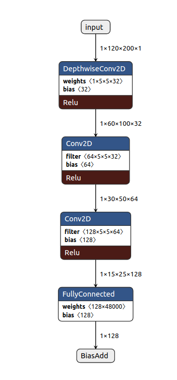

# Train VAE for lane tracking
* python train.py

# Test VAE and dump the inference ckpt.
* python3 test.py

# Convert the ckpt model to tflite model
* python3 ck2_tflite.py

# Visualize the tflite model
* 