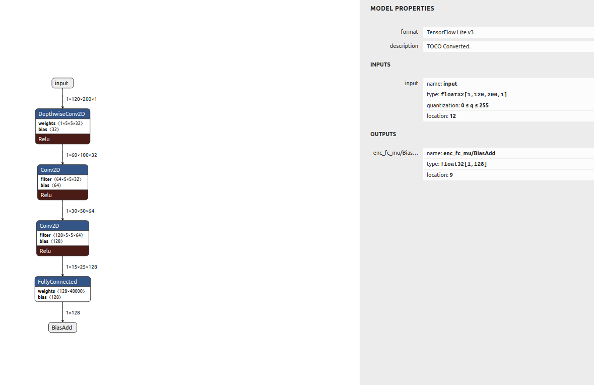
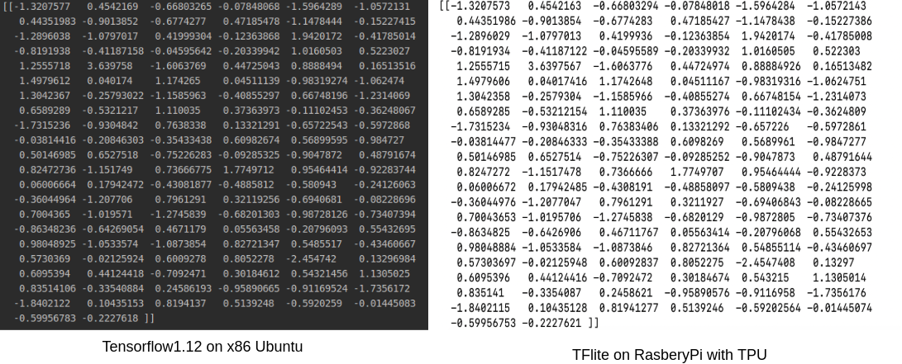

## 1. Tensorflow model training. 
* Check the operators which the google TPU(coral) supported(https://coral.ai/docs/edgetpu/models-intro/) in Table 1.
* Train tensorflow model(the unsupported ops cannot be used) and saved as ckpt format.

## 2. Convert ckpt to tflite model
* Use ck2_tflite.py script to convert ckpt format model to tflite model.
* Check the input and output ops name with netron tools(https://lutzroeder.github.io/netron/)
* 
* Check the location index of input and output ops so as to check the data when running the model on TPU.

## 3. Run the model on TPU
* See the vae.py as an example.

## 4. Check the output data
* Run the TF model and tflite model respectively, and check the output data.
 * 
 
## 5. Reference
* model quantization(https://github.com/PINTO0309/PINTO_model_zoo)
